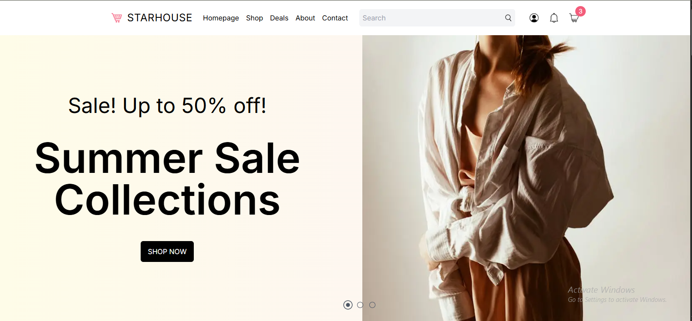
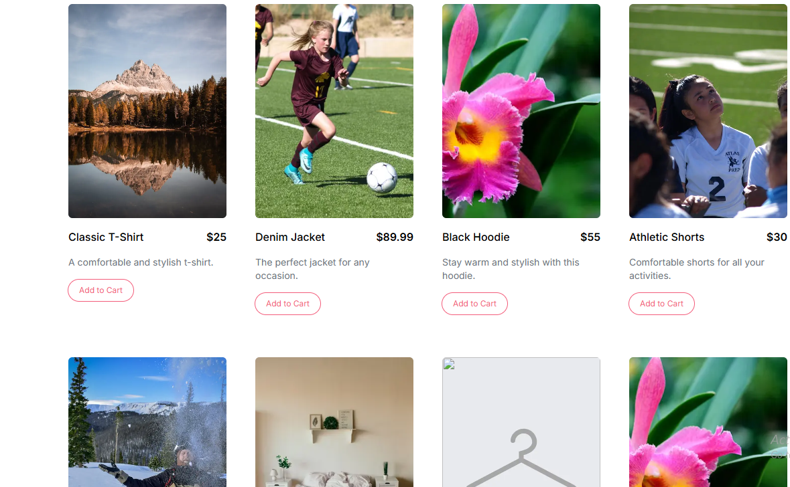

<!-- Banner / Header -->
<h1 align="center">🛒 E-Commerce Storefront</h1>
<h3 align="center">Next.js powered shopping experience with a clean, responsive UI</h3>

---

## 🧩 Project Overview

This project is a **modern e-commerce web app** that brings together design and functionality.  
It’s built to demonstrate how a storefront should look and feel: **fast, intuitive, and visually appealing**.

Whether it’s **browsing products, adding items to a cart, or simulating checkout**, everything is crafted to showcase best practices in frontend development.

🔗 **Live Demo:** [E-Commerce Storefront](https://e-commerce-4aecd45wt-abu-haneefah-s-projects.vercel.app/)

---

## 🔥 Features

- 🛍 **Browse Products** — neat grid layout with images, titles, and prices.
- 📖 **Product Details** — get more info, select options, and add to cart.
- 🛒 **Shopping Cart** — view your items, adjust quantities, and remove products.
- 💳 **Checkout UI** — clean forms for address and payment (frontend only).
- 📱 **Mobile-First Design** — responsive across phones, tablets, and desktops.
- 🧩 **Reusable Components** — flexible structure for future integrations.

---

## 🛠️ Tech Stack

<p align="center">
  
</p>

- **Framework:** Next.js (React)
- **Styling:** Tailwind CSS
- **State Management:** React state & context (or your chosen approach)
- **Validation & Forms:** (React Hook Form / Zod if included)
- **Deployment:** Vercel

---

## 📸 Preview

<p align="center">
  
  <br/>
  
</p>

---

## ⚙️ Getting Started

1. **Clone the repository**
   ```bash
   git clone https://github.com/your-username/e-commerce-frontend.git
   cd e-commerce-frontend
   ```
